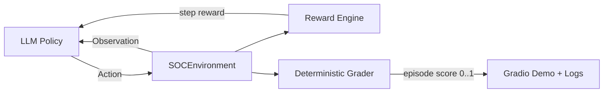

# SOC AI Gym
## Reinforcement Learning for Cyber Incident Response

SOC AI Gym is a production-style cyber incident response benchmark that combines:

- an OpenEnv-compliant FastAPI environment,
- deterministic grading and reward shaping,
- and an LLM-driven training/demo loop with Hugging Face inference.

It is designed for hackathon judging: clear scenarios, explainable logs, reproducible scoring, and demo-ready UI.

---

## Why This Project Matters

Real SOC teams need analysts (human or AI) to make fast, safe decisions under pressure:

1. **Detect** suspicious behavior
2. **Investigate** context (alerts, users, IPs, logs)
3. **Respond** with the least risky containment action

SOC AI Gym turns that workflow into a deterministic testbed for evaluating agent quality, learning behavior, and safety under constrained budgets.

---

## System Architecture



### Core components

- **`server/environment.py`**: episode state transitions (`reset`, `step`, `state`)
- **`server/reward.py`**: multi-layer shaping with penalties and efficiency
- **`server/grader.py`**: deterministic objective score in `[0.0, 1.0]`
- **`inference.py`**: Hugging Face LLM loop, feedback memory, robust parsing/fallback
- **`app.py`**: professional Gradio demo UI for judge-facing runs

---

## Task Suite

| Task | Scenario | Success Objective |
|---|---|---|
| **easy** | Brute force login attack | Detect and block attacker IP |
| **medium** | Suspicious geo login + sensitive access | Investigate and disable compromised user |
| **hard** | Phishing -> compromise -> exfiltration | Block IP, disable user, stop exfiltration |

---

## API Endpoints

| Method | Endpoint | Purpose |
|---|---|---|
| `POST` | `/reset` | Start scenario (`easy`/`medium`/`hard`) |
| `POST` | `/step` | Submit action, get reward + next observation |
| `GET` | `/state` | Current environment snapshot |
| `GET` | `/tasks` | Task metadata |
| `GET/POST` | `/grader` | Deterministic final score |
| `GET` | `/baseline` | Built-in scripted benchmark |

---

## Reward vs Grader (Important)

- **Reward** can be positive or negative per step (mistakes are penalized).
- **Grader** is final objective completion score in `[0, 1]`.

For learning analysis:
- Track **episode total reward** to see negative/positive behavior quality.
- Track **grader score** to see objective completion.

---

## Quick Start (Local)

```bash
cd soc_ai_gym
python -m venv .venv
.venv\Scripts\activate
pip install -r requirements.txt
```

### Run backend

```bash
uvicorn server.app:app --host 0.0.0.0 --port 8000
```

### Run Gradio demo UI

```bash
export API_BASE_URL=http://127.0.0.1:8000
export HF_TOKEN=hf_xxx
export OPENAI_BASE_URL=https://router.huggingface.co/v1
export MODEL_NAME=Qwen/Qwen2.5-7B-Instruct
python app.py
```

Open UI: `http://127.0.0.1:7860`

---

## Hugging Face Deployment Notes

### Required environment variables

- `HF_TOKEN` (required)
- `OPENAI_BASE_URL=https://router.huggingface.co/v1`
- `MODEL_NAME` (provider-supported model)
- `API_BASE_URL` (if UI calls external backend)

### Common failure modes

1. **410 endpoint deprecated**
   - Fix: use `router.huggingface.co`, not legacy `api-inference.huggingface.co`

2. **model_not_supported**
   - Fix: choose a model enabled for your HF provider/token

3. **task mismatch**
   - Ensure backend is restarted after code changes and that UI points to correct backend URL.

---

## Judge-Facing Demo Flow

1. Run **Easy** to show workflow learning and stable completion.
2. Run **Medium** to show user-centric containment behavior.
3. Run **Hard** to demonstrate chained response capability.
4. Highlight logs:
   - raw LLM output
   - chosen action
   - reward
   - episode score + grader

---

## Project Structure

```text
soc_ai_gym/
├── server/
│   ├── app.py
│   ├── environment.py
│   ├── state.py
│   ├── actions.py
│   ├── attack_injector.py
│   ├── reward.py
│   ├── grader.py
│   └── constants.py
├── inference.py
├── app.py
├── train.py
├── openenv.yaml
├── Dockerfile
├── requirements.txt
└── README.md
```

---

## License

For research, prototyping, and educational use.
