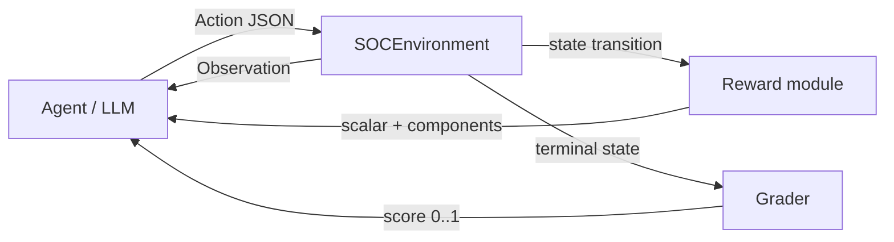

# SOC AI Gym: Reinforcement Learning for Cyber Incident Response

**SOC AI Gym** is an [OpenEnv](https://github.com/meta-pytorch/OpenEnv)-style environment that simulates a Security Operations Center (SOC). Agents consume structured observations (logs, users, alerts, IP-related context) and issue analyst actions: investigate, block IPs, disable users, acknowledge alerts, and stop exfiltration.

---

## Problem motivation

Enterprise SOCs drown in authentication, API, and network telemetry. Analysts follow **detect → investigate → respond**, but training autonomous policies safely requires a **deterministic, repeatable** world model—not production traffic. SOC AI Gym provides three graded scenarios (brute force, suspicious login, multi-stage attack) with explicit graders, shaped rewards (including time pressure and safety penalties for harming legitimate users or “safe” IPs), and a **polished FastAPI** surface for demos and hackathons.

---

## Architecture

High-level data flow from policy to grade:



- **Environment** applies actions (with **smart defaults** when `target` is empty), updates logs/users/alerts flags, and enforces **`MAX_STEPS = 8`**.
- **Reward** combines step quality, workflow shaping, efficiency, **time penalty** (`-0.05 × step_count` per step), **limit penalty** (`-1.0` if the episode ends on the step cap without full success), and **safety** penalties (e.g. wrong disable / wrong block).
- **Grader** remains deterministic and unchanged in spirit: easy / medium / hard rubrics in `[0.0, 1.0]`.

---

## Features

- **Typed Pydantic models**: `Observation`, `Action`, `Reward` (extended with `time_penalty`, `limit_penalty`)
- **HTTP API**: `POST /reset`, `POST /step`, `GET /state`, `GET /tasks`, `GET|POST /grader`, `GET /baseline`
- **Landing page** at `/` (dark theme, links to docs, baseline, tasks)
- **Three tasks** with deterministic graders
- **`inference.py`** LLM loop aligned with server step limit

---

## Tasks

| Id | Description (API `/tasks`) |
|----|------------------------------|
| **easy** | Detect and block brute-force attack |
| **medium** | Investigate suspicious login and disable compromised user |
| **hard** | Stop multi-stage attack including data exfiltration |

Graders (details unchanged from prior design): easy emphasizes blocking the attacker IP; medium splits investigation + correct disable; hard averages IP block, compromised-user disable, and exfiltration stopped.

---

## Action space

Smart defaults: omitting `target` lets the server pick the primary alert, attacker IP / alert IP, or `related_user` where applicable.

| `action_type` | `target` (optional) |
|---------------|------------------------|
| `investigate` | alert id, user id, or IP |
| `block_ip` | IP (else attacker / alert IP) |
| `disable_user` | user id (else alert `related_user`) |
| `stop_exfiltration` | hard task only |
| `acknowledge_alert` | alert id (else primary alert) |

---

## Setup

```bash
cd soc_ai_gym
python -m venv .venv
.venv\Scripts\activate   # Windows
# source .venv/bin/activate  # Linux / macOS
pip install -r requirements.txt
```

---

## Run the API server

```bash
uvicorn server.app:app --host 0.0.0.0 --port 8000
```

- **UI**: open `http://127.0.0.1:8000/` for the landing page.
- **Docs**: `http://127.0.0.1:8000/docs` (tagged: Environment, Actions, Evaluation).

### Example HTTP calls

```bash
curl -s -X POST http://127.0.0.1:8000/reset -H "Content-Type: application/json" -d "{\"task\": \"easy\"}"
curl -s -X POST http://127.0.0.1:8000/step -H "Content-Type: application/json" -d "{\"action_type\": \"investigate\"}"
curl -s http://127.0.0.1:8000/baseline
```

**`/baseline`** returns:

```json
{"easy": 1.0, "medium": 1.0, "hard": 1.0}
```

**`/tasks`** returns task descriptions plus a short list of recommended action names.

---

## Run LLM inference (`inference.py`)

| Variable | Purpose |
|----------|---------|
| `API_BASE_URL` | Gym base URL (default `http://127.0.0.1:8000`) |
| `MODEL_NAME` | Chat model id |
| `HF_TOKEN` / `OPENAI_API_KEY` | API key |
| `OPENAI_BASE_URL` | OpenAI-compatible base (default official OpenAI) |

Example:

```powershell
$env:HF_TOKEN = "sk-..."
$env:MODEL_NAME = "gpt-4o-mini"
python inference.py
```

Sample output:

```text
=== SOC AI Evaluation ===
Task easy → Score: 1.0
Task medium → Score: 1.0
Task hard → Score: 1.0
```

(Actual scores depend on the model and server state.)

---

## Docker

```bash
docker build -t soc-ai-gym .
docker run --rm -p 8000:8000 soc-ai-gym
```

---

## Project layout

```
soc_ai_gym/
├── server/
│   ├── constants.py      # MAX_STEPS
│   ├── environment.py
│   ├── state.py
│   ├── actions.py
│   ├── attack_injector.py
│   ├── reward.py
│   ├── grader.py
│   └── app.py
├── inference.py
├── train.py
├── openenv.yaml
├── Dockerfile
├── requirements.txt
└── README.md
```

---

## License

Use and modify freely for research and prototyping.
